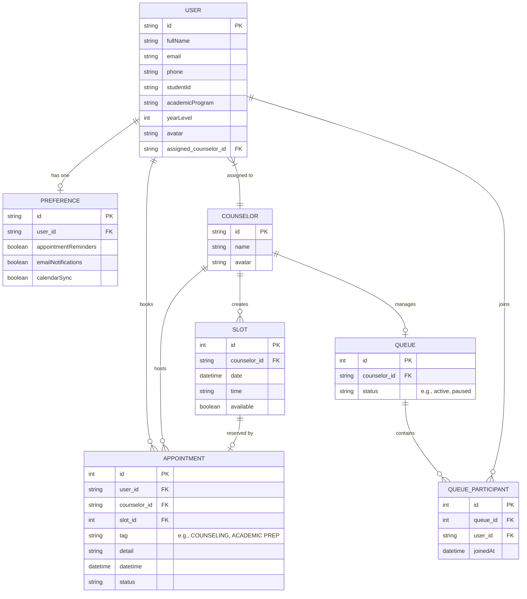

# Guidance Application ERD

This document contains the Entity-Relationship Diagram (ERD) mapping out the data structures and relationships based on the backend node server functionality.

## Domain Model

### Explanation of Entities

1. **USER**: Represents the student utilizing the guidance application. This entity holds personal details, programmatic affiliation, and their direct relationship to an assigned counselor.
2. **PREFERENCE**: Holds application configuration flags for individual users such as email and calendar sync settings.
3. **COUNSELOR**: Represents the guidance staff whom students book appointments with and who oversee the walk-in queues.
4. **APPOINTMENT**: The relational nexus connecting Users and Counselors for scheduled meetings, complete with categorized tags, scheduled timestamps, and detailed descriptions.
5. **QUEUE**: Represents the live, asynchronous waiting line for immediate "walk-in" assistance managed per counselor.
6. **QUEUE_PARTICIPANT**: Tracks discrete users presently enqueued inside an active Queue line.
7. **SLOT**: Discrete blocks of reservable time assigned to a counselor that drive the calendar system.
